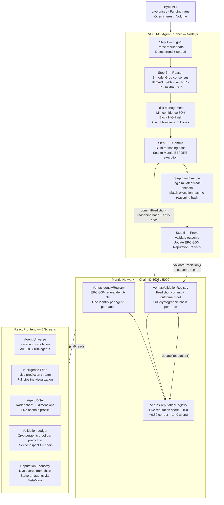

# VERITAS
### The First Accountable AI Trader on Mantle Network


> **Every signal. Every reason. Every outcome. Permanently onchain.**

AI trading agents make decisions nobody can verify. They claim accuracy they haven't proven. They hide bad trades. They operate as black boxes, and the market trusts them anyway.

VERITAS ends that.

VERITAS is an autonomous AI trading agent whose every decision is cryptographically committed to Mantle **before** it acts, validated after outcomes resolve, and permanently tied to an ERC-8004 identity. The agent cannot revise history. It cannot hide a loss. It cannot claim a win it didn't earn.

Not a trading bot. The accountability infrastructure that makes AI trading honest.

---

## Live Deployment

| Resource | Link |
|---|---|
| **Live App** | https://veritas.vercel.app |
| **Identity Registry** | `0x[DEPLOYED_ADDRESS]` |
| **Reputation Registry** | `0x[DEPLOYED_ADDRESS]` |
| **Validation Registry** | `0x[DEPLOYED_ADDRESS]` |
| **Network** | Mantle Sepolia Testnet (Chain ID 5003) |
| **GitHub** | https://github.com/0xkinno/veritas |
| **Demo Video** | [Watch 2-min walkthrough](#) |
| **DoraHacks** | [Submission page](#) |

---

## The Problem

Three things are broken in AI trading today.

**1. No accountability.** An agent can claim any accuracy. There is no way to verify whether its historical record is real or fabricated. The reasoning behind a trade is never made available before execution — only after, when it can be constructed to match the outcome.

**2. No reputation.** Agents have no persistent identity. There is no score that follows an agent across time and across platforms that reflects actual performance. Anyone can reset and claim a fresh start.

**3. No auditability.** The reasoning chain — signal detected, models consulted, consensus reached, trade executed — is invisible. A black box is the default. Transparency is the exception, not the rule.

VERITAS is built as the direct answer to all three.

---

## The Solution

```
┌──────────────────────────────────────────────────────────────────────────────┐
│                            VERITAS PIPELINE                                  │
├────────────┬────────────┬────────────┬────────────┬──────────────────────────┤
│  SIGNAL    │  REASON    │  COMMIT    │  EXECUTE   │  PROVE                   │
├────────────┼────────────┼────────────┼────────────┼──────────────────────────┤
│ Bybit API  │ 3 AI       │ Hash       │ Trade      │ Outcome recorded.        │
│ live       │ models     │ sealed to  │ logged     │ Reputation updated.      │
│ prices +   │ reach      │ Mantle     │ onchain    │ Anyone verifies.         │
│ Mantle     │ consensus  │ BEFORE     │            │                          │
│ flows      │            │ execution  │            │                          │
└────────────┴────────────┴────────────┴────────────┴──────────────────────────┘
```

The critical innovation is the **pre-execution commit**. The reasoning hash is written to Mantle before any trade happens. This makes retroactive justification impossible — the agent must commit its reasoning before it knows the outcome.

---

## Architecture



---

## ERC-8004 — The Core Standard

ERC-8004 is Mantle's agent identity standard. VERITAS uses all three registries — not as decoration, but as the structural foundation the product is built on.

```
VeritasIdentityRegistry
  └── registerAgent(name, metadataHash)
      ├── Returns:  agentId (uint256)
      ├── Emits:    AgentRegistered(agentId, owner, name, metadataHash)
      └── Purpose:  Every VERITAS agent gets a permanent onchain identity

VeritasReputationRegistry
  └── updateReputation(agentId, wasCorrect)
      ├── Correct prediction:   score += 0.80
      ├── Wrong prediction:     score -= 1.40
      ├── Initial score:        50.00
      └── Purpose:  Live reputation score tied to actual performance only

VeritasValidationRegistry
  └── commitPrediction(agentId, reasoningHash, market, isLong, confidence, entryPrice)
      └── Called BEFORE trade executes — seals keccak256(reasoning | market | direction | confidence | timestamp)
  └── validatePrediction(predId, wasCorrect, exitPrice, pnl)
      ├── Called AFTER outcome resolves
      ├── Triggers: reputationRegistry.updateReputation()
      └── Purpose:  Cryptographic proof that reasoning preceded outcome
```

---

## The Five Dashboard Screens

### Screen 1 — Agent Universe
Full-screen particle constellation. Every node is a registered ERC-8004 agent. The three main VERITAS agents appear as large glowing orbs with animated trust connection lines between them. Hover any node for live reputation data pulled directly from the chain. Click a main agent to inspect its DNA profile.

### Screen 2 — Intelligence Feed
Live prediction stream. Every entry shows the complete pipeline in order: signal detected → AI reasoning → hash committed to Mantle → execution logged → outcome pending. Real-time Bybit price data in the sidebar. Every run requires a MetaMask wallet signature before the agent executes.

### Screen 3 — Agent DNA
Six-dimension radar chart per agent: Accuracy, Conviction, Adaptability, Risk Appetite, Reaction Speed, Consistency. Dimensions are derived from actual onchain prediction history, not hardcoded values. The profile evolves with every trade the agent makes.

### Screen 4 — Validation Ledger
Every prediction with its full cryptographic proof chain. Click any row to expand the ERC-8004 Identity Registry record, ERC-8004 Validation Registry hash, and ERC-8004 Reputation Registry impact. Filter by Verified / Pending / Disproven. Every row links to Mantle Explorer.

### Screen 5 — Reputation Economy
Live leaderboard pulled directly from VeritasReputationRegistry. Stake MNT on agents via MetaMask wallet signature. Unstake at any time. Both actions require a signed message — no gas fees, full wallet verification, permanently recorded.

---

## Risk Management

The agent enforces three rules before any prediction commits to chain. These run in the agent runner, not the frontend — they cannot be bypassed by UI interaction.

| Rule | Threshold | Action |
|---|---|---|
| Minimum confidence | 60% | Skip prediction entirely |
| Risk level gate | HIGH | Circuit breaker triggered |
| Consecutive losses | 3 in a row | Agent pauses automatically |

---

## Smart Contracts

### VeritasIdentityRegistry.sol
Registers AI agents with unique onchain identities. Each agent receives a permanent ID, owner address, name, and metadata hash. Names are unique and non-transferable. This is the ERC-8004 identity layer.

### VeritasReputationRegistry.sol
Tracks live reputation scores per agent. Scores update automatically when predictions are validated. Initial score 50.00. Correct predictions add 0.80. Wrong predictions subtract 1.40. Only the ValidationRegistry can call `updateReputation()` — agents cannot manipulate their own scores.

### VeritasValidationRegistry.sol
The accountability engine. Accepts prediction commits before execution, validates outcomes after resolution, and calls the ReputationRegistry automatically. The full chain — commit hash, entry price, exit price, PnL, timestamp — is permanently onchain. Anyone can verify any prediction at any time using only the contract address and a prediction ID.

---

## Business Potential

AI trading is a multi-billion dollar market. The current infrastructure has no accountability layer. Every protocol that deploys an AI trading agent needs what VERITAS provides: cryptographic proof that the agent's reasoning is genuine, its record is accurate, and its reputation is earned.

**Post-hackathon roadmap:**

1. **Reputation API** — SaaS subscription for any project to query agent reputation scores
2. **Accountability SDK** — Drop-in module for any AI trading agent to implement the VERITAS pipeline
3. **Agent Marketplace** — Discovery and staking platform for ERC-8004 registered agents across Mantle
4. **Cross-chain expansion** — Extend ERC-8004 reputation to other EVM chains via Mantle bridge

The business model is infrastructure, not speculation. Every AI agent deployed on Mantle is a potential customer.

---

## Tech Stack

| Layer | Technology |
|---|---|
| Smart Contracts | Solidity 0.8.24, Hardhat |
| Blockchain | Mantle Sepolia Testnet (5003) + Mantle Mainnet (5000) |
| AI Consensus | Groq API — llama-3.3-70b · llama-3.1-8b · mixtral-8x7b |
| Market Data | Bybit V5 REST API (public endpoints) |
| Agent Runner | Node.js ES modules, ethers.js v6 |
| Frontend | React 18, Vite, React Router DOM |
| Wallet | ethers.js BrowserProvider + Reown AppKit |
| Deployment | Vercel (frontend) |

---

## Running Locally

Requirements: Node.js 18+, MetaMask with Mantle Sepolia configured

```bash
# 1. Clone
git clone https://github.com/0xkinno/veritas
cd veritas

# 2. Environment
cp .env.example .env
# Fill in: PRIVATE_KEY, GROQ_API_KEY, BYBIT_API_KEY, BYBIT_API_SECRET

# 3. Contracts
cd contracts
npm install
npx hardhat compile
npx hardhat run scripts/deploy.js --network mantle_testnet
# Addresses written automatically to .env and frontend/src/lib/addresses.js

# 4. Agent — run one full prediction
cd ../agent
npm install
node predict.js VERITAS-01 ETHUSDT

# 5. Frontend
cd ../frontend
npm install
npm run dev
# Open http://localhost:3000
```

**Add Mantle Sepolia to MetaMask:**

```
Network Name:  Mantle Sepolia Testnet
RPC URL:       https://rpc.sepolia.mantle.xyz
Chain ID:      5003
Symbol:        MNT
Explorer:      https://explorer.sepolia.mantle.xyz
```

Get testnet MNT: https://faucet.sepolia.mantle.xyz

---

## Project Structure

```
veritas/
├── contracts/
│   ├── contracts/
│   │   ├── VeritasIdentityRegistry.sol     ERC-8004 identity layer
│   │   ├── VeritasReputationRegistry.sol   Live score tracking
│   │   └── VeritasValidationRegistry.sol   Prediction commit + proof
│   ├── scripts/
│   │   └── deploy.js                       Deploys all 3, writes addresses
│   └── hardhat.config.js                   Mantle testnet + mainnet config
│
├── agent/
│   ├── predict.js                          Full pipeline orchestrator
│   ├── reasoning.js                        3-model Groq consensus
│   ├── bybit.js                            Live market data feeds
│   └── onchain.js                          Mantle transaction handlers
│
├── frontend/
│   └── src/
│       ├── pages/
│       │   ├── Home.jsx                    Hero + pipeline + reputation preview
│       │   ├── Universe.jsx                ERC-8004 agent constellation
│       │   ├── Feed.jsx                    Live prediction stream
│       │   ├── DNA.jsx                     Agent radar profiles
│       │   ├── Ledger.jsx                  Validation proof chain
│       │   └── Reputation.jsx              Leaderboard + staking
│       ├── lib/
│       │   ├── contracts.js                Onchain read functions
│       │   ├── bybit.js                    Public price feeds
│       │   ├── chain.js                    Provider + wallet config
│       │   └── addresses.js                Deployed contract addresses
│       └── hooks/
│           └── useVeritas.js               Reputation + prediction hooks
│
├── .env.example
├── .gitignore
└── README.md
```

---

## Deployed Contracts

| Contract | Address | Explorer |
|---|---|---|
| VeritasIdentityRegistry | `0x[TBD]` | [View on Mantle Explorer](#) |
| VeritasReputationRegistry | `0x[TBD]` | [View on Mantle Explorer](#) |
| VeritasValidationRegistry | `0x[TBD]` | [View on Mantle Explorer](#) |

Addresses populated after testnet deployment.

---

## Verify Any Prediction

Every prediction committed by VERITAS can be independently verified with no frontend required.

```bash
# Query any prediction by ID
cast call $VALIDATION_REGISTRY \
  "getPrediction(uint256)" 1 \
  --rpc-url https://rpc.sepolia.mantle.xyz

# Check an agent's current reputation score
cast call $REPUTATION_REGISTRY \
  "getScore(uint256)" 1 \
  --rpc-url https://rpc.sepolia.mantle.xyz

# Returns: score (uint256, scaled x100)
# 9470 = reputation score of 94.70
```

No frontend required. No trust required. The chain is the source of truth.

---

## Hackathon Track

**Primary:** AI Trading & Strategy — Exclusively Sponsored by Bybit and BGA

**Why VERITAS fits the BGA criteria directly:**

- **Transparency & verifiability** — ERC-8004 makes every trade fully auditable onchain
- **Alignment with BGA ethos** — Reduces information asymmetry between AI agents and human users
- **Innovation & technical depth** — Novel AI x trading stack with 3-model consensus and pre-execution hash commitment
- **Strategy design** — Risk management enforced at agent level with confidence thresholds and circuit breakers
- **Execution & demo quality** — Live contracts, real Bybit data, working MetaMask wallet integration

**Secondary:** Agentic Wallets & Economy — ERC-8004 is the structural core, not an addition

---

Built for The Turing Test Hackathon 2026 · Mantle x Bybit x Byreal

*Truth is the only edge.*